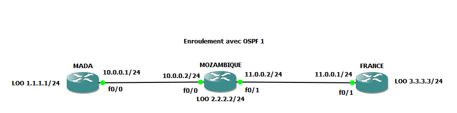

# MPLS and OSPF Configuration for a Site-to-Site VPN

This project demonstrates the configuration of a site-to-site VPN with MPLS and OSPF between multiple routers.



## Objective

The goal of this project is to configure an MPLS network between three sites (MADA, MOZAMBIQUE, FRANCE) with OSPF for dynamic routing and MPLS for data transfer between the sites. This project aims to provide reliable connectivity between multiple remote sites via a virtual private network (VPN).

## Prerequisites

- Three Cisco routers (MADA, MOZAMBIQUE, FRANCE).
- Access to the router command line.
- Basic configuration of the network interfaces for each router.

## Network Topology

The network topology is as follows:

## Configuration de base des routeurs

### 1. Routeur MADA (Cisco 2691 124-15.T14)

```bash
conf t
int f0/0
ip address 10.0.0.1 255.255.255.0
no sh
int lo0
ip address 1.1.1.1 255.255.255.0
exit
do wr
exit

# Activation d'OSPF
conf t
router ospf 1
network 0.0.0.0 255.255.255.255 area 0
ctrl+z
wr

# Activation de MPLS
conf t
int f0/0
mpls ip
ctrl+Z
wr
sh mpls ldp neighbor
sh mpls forwarding-table
```

### 2. Routeur MOZAMBIQUE (Cisco 2691 124-15.T14)

```bash
conf t
int f0/0
ip address 10.0.0.2 255.255.255.0
no sh
int lo0
ip address 2.2.2.2 255.255.255.0
int f0/1
ip address 11.0.0.2 255.255.255.0
no sh
ctrl+Z
wr

# Activation d'OSPF
conf t
router ospf 1
log-adjacency-changes
network 0.0.0.0 255.255.255.255 area 0
ctrl+Z
sh run

# Activation de MPLS
conf t
int f0/0
mpls ip
int f0/1
mpls ip
ctrl+Z
wr
sh mpls ldp neighbor
sh mpls forwarding-table

```

### 3. Routeur FRANCE (Cisco 2691 124-15.T14)

```bash
conf t
int f0/1
ip address 11.0.0.1 255.255.255.0
no sh
int lo0
ip address 3.3.3.3 255.255.255.0
ctrl+Z
wr

# Activation d'OSPF
conf t
router ospf 1
log-adjacency-changes
network 0.0.0.0 255.255.255.255 area 0
ctrl+Z

# Activation de MPLS
conf t
int f0/1
mpls ip
ctrl+Z
wr
sh mpls ldp neighbor
sh mpls forwarding-table

```

### Verifications
```bash
# Vérification de l'état de l'interface MPLS
sh mpls ldp neighbor

# Vérification de la table de commutation MPLS
sh mpls forwarding-table

# Vérification des voisins OSPF
sh ip ospf neighbor
```

### Explanation of the structure:
- **Project Introduction**: Explains the objective of the project, namely the configuration of a site-to-site VPN with MPLS and OSPF.
- **Prerequisites**: Describes the elements needed to begin the configuration.
- **Network Topology**: A simple diagram (in text) to explain the router configuration.
- **Router Configuration**: Each section provides the commands needed to configure the interfaces and enable OSPF and MPLS on each router.
- **Verifications**: Explains how to verify that the configurations are applied correctly and that OSPF and MPLS neighbors are correctly established.
- **Conclusion**: Summarizes what has been accomplished and the expected results.
- **License**: A section template to include a license if necessary.

This `README.md` file can be placed at the root of your GitHub repository or other version control system to provide clear instructions to users who wish to reproduce or use this configuration.

## License

Copyright © 2025 [Andrandraina](facebook.com/andrandraina.randrianaivo.10). All rights reserved.